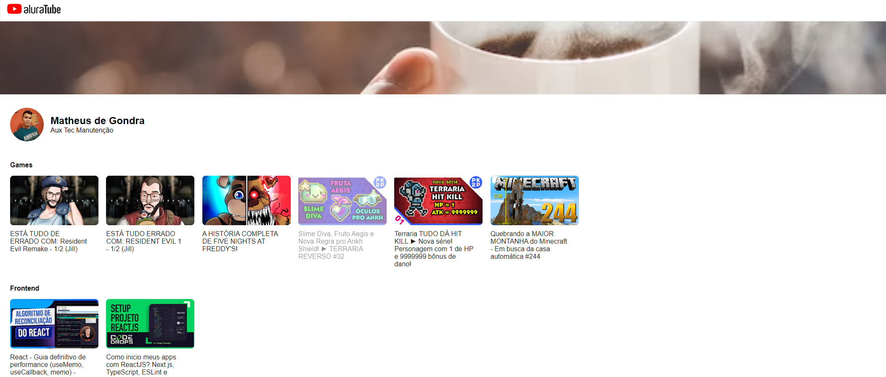

# Nome do meu projeto

Rápida descrição do objetivo de fazer esse projeto

| :placard: Vitrine.Dev |     |
| -------------  | --- |
| :sparkles: Nome        | **AluraTube**
| :label: Tecnologias | ReactJS, NextJS, Javascript, Styled-Components, CSS, HTML
| :rocket: URL         | [AluraTube](https://aluratube-tau-eight.vercel.app/)
| 🔥 Desafio      | [Design no Figma](https://www.figma.com/file/3ryManadSVXjYYdva3orGD/Aluratube-(Copy)?node-id=5%3A2) |

<!-- Inserir imagem com a #vitrinedev ao final do link -->

## Detalhes do projeto

O AluraTube é um clone da plataforma do youtube onde podemos ver os nossos vídeos favoritos por categorias.

Esse projeto foi desenvolvido junto da [Alura](https://www.alura.com.br/) durante a Imersão React. Nessa imersão temos o instrutor [Mario Souto](https://github.com/omariosouto), e também, a participação de [Nayanne Batista](https://github.com/NayanneBatista) e do [Paula Silveira](https://github.com/peas).

#

Desenvolvido por [Matheus de Gondra](https://github.com/matheusgondra).
